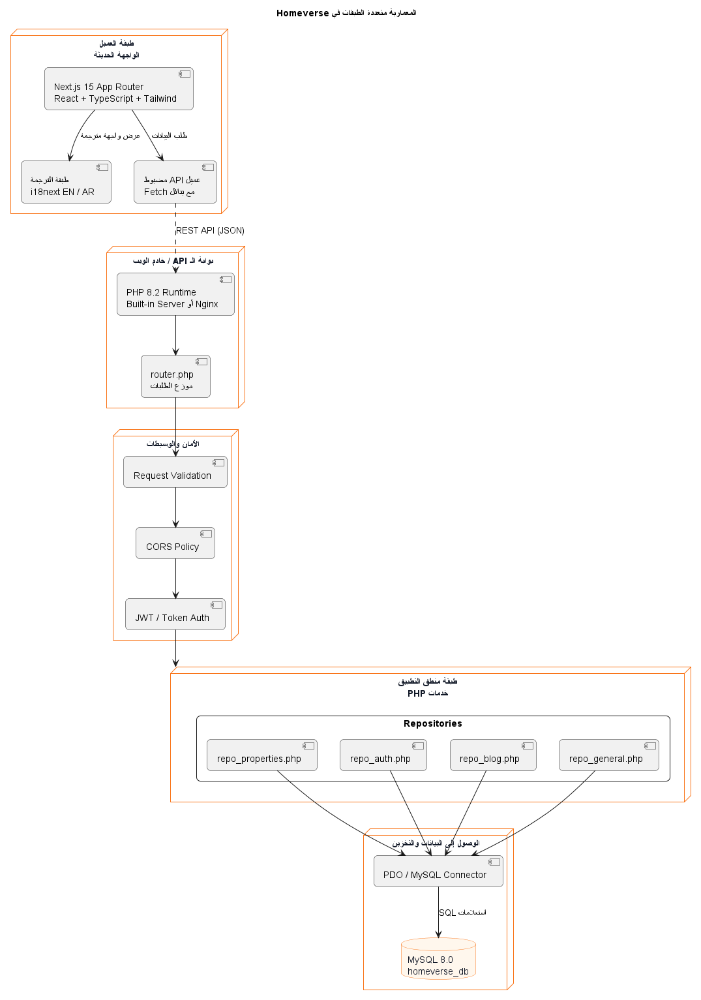
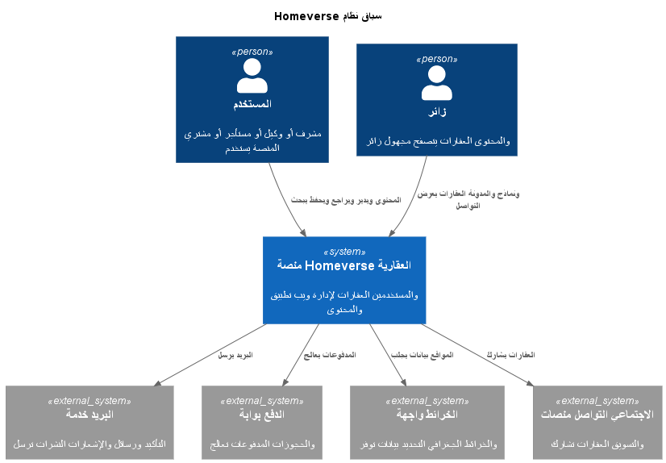
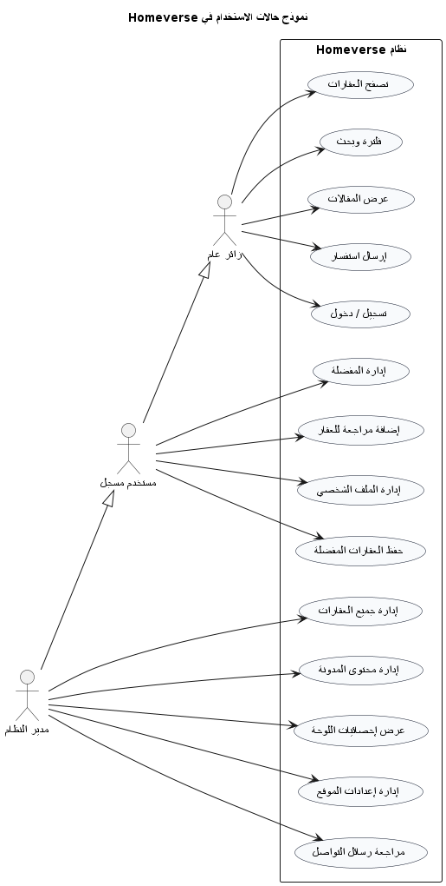
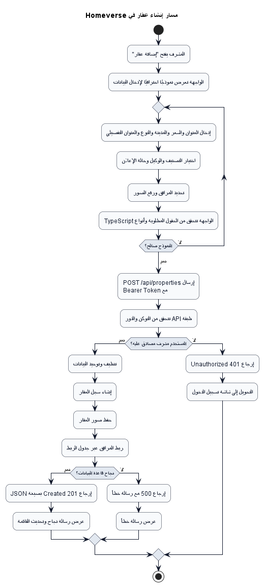
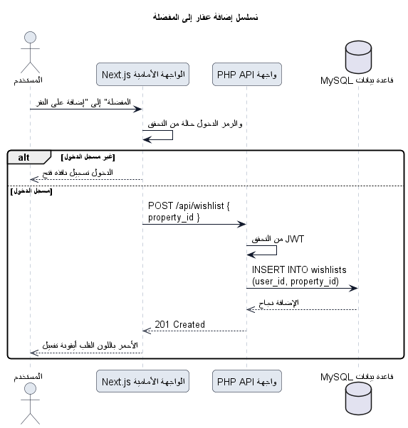
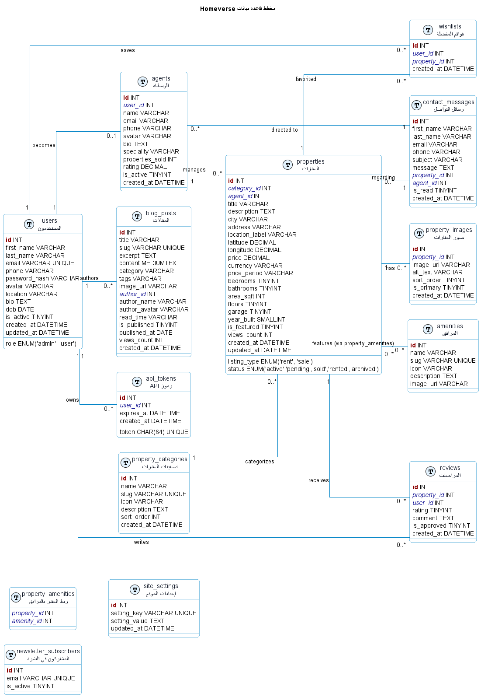

<!--
  Copyright (c) 2025 Ahmed Fahmy
  Developed at UFUQ TECH
  Proprietary software. See LICENSE file in the project root for full license information.
-->

---
title: "الكتاب التعريفي لمشروع Homeverse - النسخة العربية"
author: "Ahmed Fahmy (Ufuq Tech)"
date: "April 2026"
version: "3.0.0"
toc: true
toc-depth: 4
---

<div align="center">


# كتاب مشروع Homeverse

### النسخة العربية

توثيق احترافي متكامل لمنصة Homeverse العقارية.

*إعداد أحمد فهمي - Ufuq Tech - أبريل 2026*

</div>

---

## فهرس المحتويات

- [الفصل 1. الملخص التنفيذي](#chapter-1-executive-summary)
- [الفصل 2. أهداف المنتج والأدوار](#chapter-2-product-goals-and-user-roles)
- [الفصل 3. المعمارية وتصميم النظام](#chapter-3-architecture-and-system-design)
- [الفصل 4. التدفقات الوظيفية](#chapter-4-functional-workflows)
- [الفصل 5. نموذج قاعدة البيانات](#chapter-5-database-model)
- [الفصل 6. مرجع واجهة المستخدم](#chapter-6-user-interface-reference)
- [الفصل 7. مرجع اللقطات البرمجية](#chapter-7-code-snapshot-reference)
- [الفصل 8. نظرة عامة على واجهات الـ API والتوجيه](#chapter-8-api-and-routing-overview)
- [الفصل 9. الأمان والاعتمادية والملاحظات التشغيلية](#chapter-9-security-reliability-and-operational-notes)
- [الفصل 10. الإعداد والنشر](#chapter-10-setup-and-deployment)
- [الفصل 11. الخلاصة](#chapter-11-conclusion)

## مقدمة الكتاب

هذا المستند هو النسخة العربية الكاملة للكتاب التعريفي الخاص بمشروع Homeverse. ويُستخدم كمرجع شامل للمشروع، والمعمارية، وواجهة المستخدم، وواجهات البرمجة، ونموذج البيانات، والأمان، وأدلة التنفيذ.

---

<a id="chapter-1-executive-summary"></a>

# الفصل 1. الملخص التنفيذي

## 1.1 نظرة عامة على المشروع
Homeverse هو نظام عقاري متكامل يجمع بين واجهة أمامية حديثة مبنية بـ Next.js وواجهة خلفية مبنية بـ PHP API. يدعم النظام اكتشاف العقارات، وإدارة الإعلانات، وتشغيل الوكلاء، ونشر المحتوى، وتفاعل المستخدمين، والتحكم الإداري ضمن منتج واحد متماسك.

تم تصميم المنصة لتخدم في الوقت نفسه التصفح العام الراقي والعمل الإداري الجاد. يمكن للزائر استكشاف العقارات وقراءة المقالات والتواصل مع الوكلاء ومقارنة الإعلانات. ويمكن للمستخدم المسجل إدارة المفضلة وإضافة التقييمات ومتابعة نشاطه. كما يستطيع المشرف إدارة العقارات والمحتوى والرسائل والإعدادات.

## 1.2 الرؤية
تهدف Homeverse إلى تحويل تجربة البحث العقاري إلى تجربة واضحة وأنيقة وموثوقة. ويركز المنتج على السرعة، وجودة العرض، ودعم اللغتين العربية والإنجليزية، وسهولة صيانة الكود حتى يمكن توسيعه مع نمو العمل.

## 1.3 القيمة التجارية
تقدم Homeverse قيمة عملية من خلال:
- عرض احترافي للعقارات
- صفحات ومحتوى مناسب لمحركات البحث
- تبسيط مهام الإدارة
- دعم متعدد اللغات للمستخدمين العرب والإنجليز
- بنية قابلة لإعادة الاستخدام ومبنية على الـ API

## 1.4 نطاق المشروع
يشمل المشروع:
- واجهة أمامية حديثة داخل `Front/`
- واجهة خلفية من نوع Laravel-style API داخل `Api/`
- مخططات التصميم والمعمارية داخل `Documentation/Diagrams/`
- صور واجهة المستخدم داخل `Documentation/UI/images/`
- صور اللقطات البرمجية داخل `Documentation/CodeSnaps/`

---

<a id="chapter-2-product-goals-and-user-roles"></a>

# الفصل 2. أهداف المنتج والأدوار

## 2.1 الأهداف
تم بناء Homeverse لجعل اكتشاف العقارات وإدارتها أسهل وأسرع وأكثر موثوقية.

## 2.2 الأدوار الرئيسية
- زائر عام: يتصفح العقارات والمقالات والصفحات التعريفية ونماذج التواصل.
- مستخدم مسجل: يدير ملفه الشخصي، ويحفظ العقارات، ويكتب التقييمات، ويتابع النشاط.
- وكيل: يدير العقارات المسندة إليه ويتابع الاستفسارات.
- مشرف: يدير كل العقارات والمحتوى والمستخدمين والإعدادات والإحصائيات.

## 2.3 مجالات الوظائف
- السوق والبحث
- صفحة تفاصيل العقار
- تسجيل الدخول وإدارة الحساب
- المدونة والصفحات المعلوماتية
- لوحة المستخدم ولوحة الإدارة
- الدعم والتواصل

---

<a id="chapter-3-architecture-and-system-design"></a>

# الفصل 3. المعمارية وتصميم النظام

## 3.1 البنية متعددة الطبقات
يعتمد Homeverse على بنية API-first متعددة الطبقات. الواجهة الأمامية تعرض التجربة وتتواصل مع الواجهة الخلفية من خلال طلبات مضبوطة. أما الواجهة الخلفية فتتولى المصادقة والتحقق من البيانات وقواعد العمل والوصول إلى قاعدة البيانات.



## 3.2 سياق النظام
يوضح مخطط السياق أن Homeverse هو المنصة المركزية المتصلة بالمستخدمين والخدمات الخارجية مثل البريد والخرائط والمدفوعات والمشاركة الاجتماعية.



## 3.3 التقنيات المستخدمة
- الواجهة الأمامية: Next.js 15 وReact وTypeScript وTailwind CSS
- الواجهة الخلفية: PHP 8.2 مع التوجيه وMiddleware الخاص بالرموز
- قاعدة البيانات: MySQL 8
- التوثيق: Markdown وPlantUML وصور واجهة المستخدم واللقطات البرمجية

---

<a id="chapter-4-functional-workflows"></a>

# الفصل 4. التدفقات الوظيفية

## 4.1 حالات الاستخدام
يوضح مخطط حالات الاستخدام ما الذي يمكن لكل دور فعله داخل النظام.



## 4.2 تدفق إنشاء عقار
يوضح مخطط النشاط المسار الكامل لإضافة عقار من لوحة الإدارة حتى حفظه في قاعدة البيانات.



## 4.3 تدفق المفضلة
يوضح مخطط التسلسل التفاعل بين المستخدم والواجهة الأمامية وواجهة الـ API وقاعدة البيانات عند حفظ عقار في المفضلة.



---

<a id="chapter-5-database-model"></a>

# الفصل 5. نموذج قاعدة البيانات

## 5.1 نظرة عامة على ERD
يمثل مخطط الكيانات والعلاقات العمود الفقري للنظام. فهو يعرّف المستخدمين والوكلاء والعقارات والصور والمرافق والتقييمات والمقالات وقوائم المفضلة ورسائل التواصل والرموز والإعدادات.



## 5.2 الجداول الرئيسية
- users: حسابات المستخدمين والأدوار
- api_tokens: المصادقة باستخدام الرموز
- agents: ملفات الوكلاء وبياناتهم
- properties: بيانات الإعلانات العقارية الأساسية
- property_images: صور المعرض لكل عقار
- amenities: وسوم المرافق القابلة لإعادة الاستخدام
- property_amenities: الربط متعدد القيم بين العقارات والمرافق
- reviews: تقييمات المستخدمين للعقارات
- wishlists: العقارات المحفوظة لكل مستخدم
- contact_messages: رسائل الاستفسارات الواردة
- blog_posts: المحتوى والمقالات
- newsletter_subscribers: الاشتراك التسويقي
- site_settings: الإعدادات العامة للموقع

## 5.3 ملاحظات تصميم البيانات
تمت مواءمة تصميم قاعدة البيانات بحيث يكون منظمًا للكيانات التشغيلية، مع الحفاظ على المرونة في مناطق المحتوى مثل المقالات والوسائط. وهذا يخدم الاستقرار التشغيلي ونمو المحتوى في نفس الوقت.

---

<a id="chapter-6-user-interface-reference"></a>

# الفصل 6. مرجع واجهة المستخدم

## 6.1 مبادئ التصميم
الواجهة مصممة بطابع فاخر وأنيق يشبه المجلات التحريرية. تعتمد على الخلفيات الداكنة، واللمسات البرتقالية الدافئة، وتقديم الصور بشكل قوي، والحركة الناعمة، ودعم الهاتف المحمول أولًا.

## 6.2 الصفحة الرئيسية
نسختا سطح المكتب والهاتف المحمول للواجهة الرئيسية.


## 6.3 السوق العقاري والبحث
تجربة عرض العقارات مع الفلاتر والبطاقات والتنقل على الهاتف.


## 6.4 صفحة تفاصيل العقار
تجمع صفحة التفاصيل بين المعرض والإحصاءات ولوحة الوكيل والمرافق.


## 6.5 تجربة المدونة
صفحات المحتوى التحريري المصممة لدعم محركات البحث والقراءة الطويلة.


## 6.6 صفحات الخدمات والمعلومات
صفحات داعمة للثقة والسياسات وتثقيف المستخدم.


## 6.7 شاشات المصادقة
شاشات تسجيل الدخول والتسجيل المستخدمة في رحلة المستخدم.


## 6.8 لوحات المستخدم والإدارة
لوحات تشغيلية للمستخدم العادي وللمشرف.


## 6.9 تغطية الواجهة
تغطي الصور أعلاه أهم التجارب التي يراها المستخدم والمشرف: الاكتشاف، والمحتوى، وإدارة الحساب، وصفحات الثقة، ولوحات التحكم.

---

<a id="chapter-7-code-snapshot-reference"></a>

# الفصل 7. مرجع اللقطات البرمجية

## 7.1 دليل الواجهة الأمامية
توثّق هذه اللقطات تنفيذ عناصر الواجهة الأمامية الأساسية مثل الهيدر، والهيرو، وتبديل اللغة، والبنية العامة للواجهة.


## 7.2 دليل الواجهة الخلفية وواجهات الـ API
توضح هذه اللقطات التوجيه الخلفي، وMiddleware الخاص بالرموز، ومنطق تشغيل التطبيق.


## 7.3 دليل قاعدة البيانات والمخططات
تُظهر لقطات الـ SQL البنية الفعلية للجداول والعلاقات التي يعتمد عليها النظام.


## 7.4 ملاحظات حول اللقطات البرمجية
تم توفير صور الكود كدليل عملي على جودة التنفيذ واتساق المعمارية. وهي مفيدة جدًا للمراجعة التقنية والتسليم والتتبع التوثيقي.

---

<a id="chapter-8-api-and-routing-overview"></a>

# الفصل 8. نظرة عامة على واجهات الـ API والتوجيه

## 8.1 سطح الـ API
توفّر الواجهة الخلفية مسارات للمصادقة، والعقارات، والوكلاء، والمرافق، والمقالات، ونماذج التواصل، والمفضلة، وإعدادات الموقع.

## 8.2 تصميم المسارات
تم ترتيب المسارات بحيث تكون هناك فواصل واضحة بين الوصول العام، وميزات المستخدم المسجل، والعمليات الخاصة بالمشرف.

## 8.3 مسار الطلب
يمر الطلب عادة بالمراحل التالية:
1. الصفحة أو المكوّن في الواجهة الأمامية يطلق طلب fetch
2. الموجّه الخلفي يستقبل الطلب
3. تقوم الـ middleware بالتحقق من الرمز أو القيود
4. تنفذ المستودعات أو المتحكمات قواعد العمل
5. تعيد قاعدة البيانات البيانات المطلوبة أو تُثبتها
6. تعرض الواجهة النتيجة أو تنتقل لحالة UI آمنة

---

<a id="chapter-9-security-reliability-and-operational-notes"></a>

# الفصل 9. الأمان والاعتمادية والملاحظات التشغيلية

## 9.1 المصادقة
يعتمد Homeverse على المصادقة بالرموز عند تنفيذ الإجراءات المحمية.

## 9.2 التحقق والتنقية
تُتحقق الطلبات الواردة قبل الحفظ، كما يتم تنقية المدخلات لتقليل فرص البيانات غير السليمة أو غير الآمنة.

## 9.3 الاعتمادية
تم تصميم الواجهة الأمامية بحيث تظل قابلة للاستخدام حتى لو كانت واجهة الـ API غير متاحة مؤقتًا، وذلك عبر سلوك fallback مضبوط ورسائل خطأ واضحة.

## 9.4 الجاهزية للإنتاج
تم إعداد المنصة لتعمل مع نشر منفصل للواجهة الأمامية وواجهة الـ API، ومتغيرات بيئة صحيحة، وإعدادات بنية تحتية آمنة.

---

<a id="chapter-10-setup-and-deployment"></a>

# الفصل 10. الإعداد والنشر

## 10.1 التطوير المحلي
الواجهة الأمامية:
```bash
cd Front
npm install
npm run dev
```

الواجهة الخلفية:
```bash
cd Api
composer install
php artisan migrate
php artisan db:seed
php artisan serve --host=127.0.0.1 --port=8000
```

## 10.2 النشر في الإنتاج
- اضبط `NEXT_PUBLIC_API_URL` على عنوان الـ API الإنتاجي.
- فعّل CORS للسماح بنطاق الواجهة المنشورة.
- اعمل cache للإعدادات والمسارات في PHP.
- يمكن نشر الواجهة الأمامية والواجهة الخلفية بشكل منفصل حسب الاستضافة.

## 10.3 فهرس الملفات
- المخططات: `Documentation/Diagrams/png/`
- صور واجهة المستخدم: `Documentation/UI/images/`
- اللقطات البرمجية: `Documentation/CodeSnaps/`

---

<a id="chapter-11-conclusion"></a>

# الفصل 11. الخلاصة
تم توثيق Homeverse هنا كنظام منتج كامل وليس مجرد مجموعة شاشات أو نقاط نهاية. فالمعمارية، والمخططات، وصور الواجهة، واللقطات البرمجية، وملاحظات النشر كلها موجهة لدعم دورة حياة إنتاجية حقيقية: تصميم، تنفيذ، مراجعة، نشر، وصيانة.
